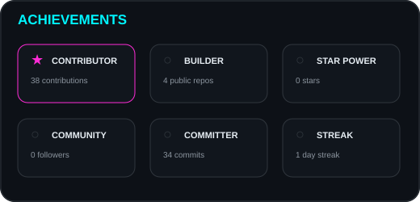
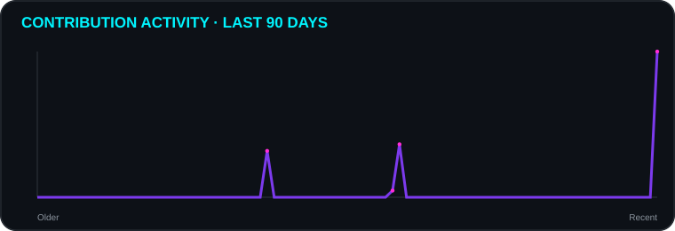

 

⚡ SYSTEM STATUS

╭────────────────────────────────────────────────────────────────────╮
│  AYUSH TODKAR // DEVELOPER PROFILE                               │
├────────────────────────────────────────────────────────────────────┤
│  STATUS        ● ONLINE                                           │
│  MODE          BUILD → LEARN → SHIP → IMPROVE                    │
│  CURRENTLY     Exploring Web Development + Cloud + Systems       │
│  MINDSET       Curiosity > Comfort                               │
╰────────────────────────────────────────────────────────────────────╯

I don't just collect technologies. I build with them.

🧠 ABOUT THE DEVELOPER

I'm a Computer Engineering student and developer interested in building practical software and understanding how things work underneath the interface.

🔭 Building and refining real-world projects

🌐 Exploring Web Development

☁️ Exploring Cloud Computing & Azure

🧩 Interested in Systems, Operating Systems & problem solving

🛠️ Learning through implementation rather than tutorials alone

🎯 Long-term goal: become a versatile software engineer

🛸 TECH ARSENAL

LANGUAGES

DEVELOPMENT

CLOUD & PLATFORMS

🚀 FEATURED PROJECTS

## 🚀 FEATURED PROJECTS

<table>
<tr>

<td width="50%" valign="top">

<h3>🛡️ Deadlock Detector & Recovery Simulator</h3>

An interactive systems project focused on understanding
Operating System deadlock detection and recovery concepts
through simulation and visualization.

<b>Focus:</b> 
<code>Algorithms</code> <code>Operating Systems</code>
<code>Simulation</code> <code>UI</code>

<a href="https://github.com/AyushTodkar404/DEADLOCK-DETECTOR-AND-RECOVERY-SIMULATOR">
<b>🔗 View Repository →</b>
</a>

</td>

<td width="50%" valign="top">

<h3>🧾 FixMySpot — Civic Complaints & Maintenance Tracker</h3>

A full-stack civic issue management platform connecting
citizens with municipal authorities for reporting,
tracking and resolving public issues.

<b>Focus:</b> 
<code>React</code> <code>MongoDB</code> <code>RBAC</code>
<code>Dashboards</code> <code>Maps</code> <code>Analytics</code>

<a href="https://github.com/AyushTodkar404/FIXMYSOT-CIVIC-COMPLAINTS-AND-MAINTAINENCE-TRACKER">
<b>🔗 View Repository →</b>
</a>

</td>

</tr>

<tr>

<td width="50%" valign="top">

<h3>💼 Personal Portfolio Website</h3>

A responsive personal developer portfolio showcasing
projects, technical skills, education, achievements
and professional interests.

<b>Focus:</b> 
<code>HTML</code> <code>CSS</code> <code>JavaScript</code>
<code>Responsive Design</code> <code>UI</code>

<a href="https://github.com/AyushTodkar404/MY-PERSONAL-PORTFOLIO-WEBSITE">
<b>🔗 View Repository →</b>
</a>

</td>

<td width="50%" valign="top">

<h3>🔭 Currently Building</h3>

Continuously expanding my portfolio through
practical projects in systems, web development,
automation and modern software engineering.

<code>Learn</code> → <code>Build</code> → <code>Improve</code> → <code>Repeat</code>

</td>

</tr>
</table>

🔥 More projects coming

This profile is intentionally built as a living portfolio.

New experiments, improvements and serious builds will appear here as they are shipped.

</td>
</tr>
</table>

📊 GITHUB COMMAND CENTER

🏆 TROPHIES

📈 CONTRIBUTION ACTIVITY

🐍 CONTRIBUTION MATRIX

<picture>
  <source media="(prefers-color-scheme: dark)" srcset="https://raw.githubusercontent.com/AyushTodkar404/AyushTodkar404/output/github-contribution-grid-snake-dark.svg">
  <source media="(prefers-color-scheme: light)" srcset="https://raw.githubusercontent.com/AyushTodkar404/AyushTodkar404/output/github-contribution-grid-snake.svg">
  
</picture>

🎯 CURRENT OPERATING MODE

<table align="center">
<tr>
<td align="center">🌐 <b>WEB</b> Building interfaces</td>
<td align="center">☁️ <b>CLOUD</b> Exploring Azure</td>
<td align="center">⚙️ <b>SYSTEMS</b> Understanding internals</td>
<td align="center">🧠 <b>DSA</b> Sharpening logic</td>
<td align="center">🚀 <b>SHIPPING</b> Turning ideas into repos</td>
</tr>
</table>

📡 DEVELOPER PHILOSOPHY

Learn deeply. Build visibly. Document clearly. Improve relentlessly.

I want my GitHub to tell a story: not just what I know, but what I have built, what I'm learning and how I'm improving.

🌐 CONNECT

BUILD // BREAK // LEARN // REBUILD
